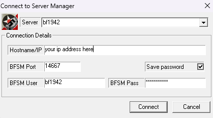
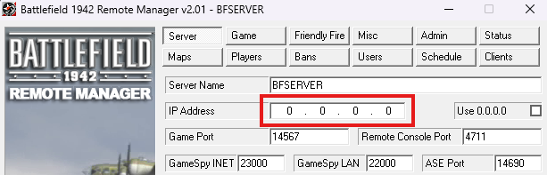
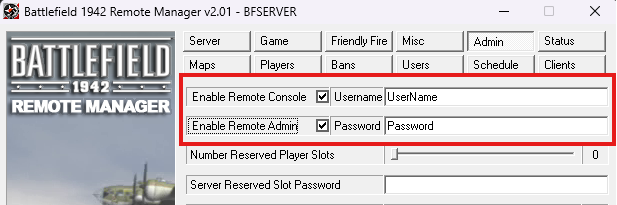
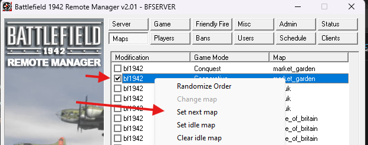
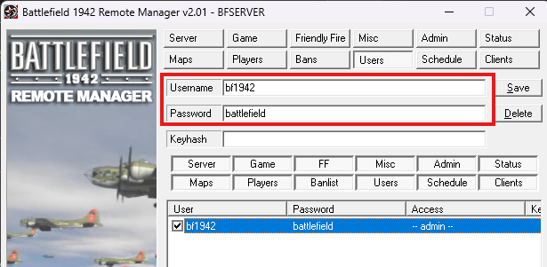

# 🪖 Battlefield 1942 Dedicated Server (Linux)

Automated setup for running **Battlefield 1942 Dedicated Servers** on modern 64-bit Linux with **multi-instance support**. Handles all dependency resolution (including legacy 32-bit libraries), user creation, systemd service setup, and firewall configuration in a single interactive script.

---

## 🧩 Overview

- **Single-script setup** — one script handles everything: standalone or BFSMD managed mode
- **Multi-instance support** — run multiple servers on one machine with automatic port allocation
- **Smart configuration** — interactive IP detection, port conflict prevention, resource validation
- **Performance optimized** — CPU affinity, memory limits, and I/O tuning per instance
- **Secure by default** — runs under a dedicated non-privileged account (`bf1942_user`)
- **Firewall integration** — UFW on Debian/Ubuntu, firewalld on Fedora/RHEL/CentOS
- **Systemd managed** — standard `systemctl` commands for all service control
- **Shared management tool** — one `bf1942_manager.sh` at the repo root works across all distros

---

## 🧪 Supported Distributions

| Distro | Script |
|--------|--------|
| **Ubuntu 24.04 LTS** | `installers/ubuntu/ubu_24.0.3_bfsmd_setup.sh` |
| **Ubuntu 22.04 LTS** | `installers/ubuntu/ubu_22.04_bfsmd_setup.sh` |
| **Debian 12 (Bookworm) / 13 (Trixie)** | `installers/debian/deb_12_bfsmd_setup.sh` |
| **Fedora 40 / 41** | `installers/fedora/fed_40_bfsmd_setup.sh` |
| **RHEL 9** | `installers/rhel/rhel_9_bfsmd_setup.sh` |
| **CentOS Stream 9** | `installers/centos/centos_stream9_bfsmd_setup.sh` |

---

## 🚀 Quick Start

> **Prerequisite:** A user with **sudo** privileges

### 1️⃣ Download

Pick your distro's script from the table above, then download it along with the management tool:

```bash
# Example: Ubuntu 24.04
wget https://raw.githubusercontent.com/hootmeow/bf1942-linux/main/installers/ubuntu/ubu_24.0.3_bfsmd_setup.sh
wget https://raw.githubusercontent.com/hootmeow/bf1942-linux/main/bf1942_manager.sh
chmod +x ubu_24.0.3_bfsmd_setup.sh bf1942_manager.sh
```

Replace `ubu_24.0.3_bfsmd_setup.sh` with your distro's script name from the table above. `bf1942_manager.sh` is the same file for all distros — you only need one copy.

### 2️⃣ Run the Installer

```bash
sudo ./<your-setup-script>.sh
```

The script is fully interactive. It will walk you through:

1. **Installation mode** — choose Standalone (no remote management) or BFSMD (full GUI management via BFRM)
2. **Instance name** *(BFSMD only)* — a unique name like `server1`, `conquest`, `tdm`
3. **IP address** — auto-detected; choose local, public, or enter custom
4. **BFSMD version** *(BFSMD only)* — v2.0 (recommended) or v2.01 (fixes admin/PunkBuster bugs)
5. **Firewall rules** — optional, interactive security level selection

### 3️⃣ Add More Instances *(BFSMD Only)*

```bash
sudo ./<your-setup-script>.sh server2
sudo ./<your-setup-script>.sh hootmeow
```

Each instance automatically gets unique ports, its own systemd service, and dedicated CPU cores when available.

### Distro-Specific Notes

| Distro | Key Differences |
|--------|----------------|
| Ubuntu 24.04 | Uses `libcurl4t64:i386` (auto-detected) |
| Ubuntu 22.04 | Uses `libcurl4:i386` |
| Debian 12/13 | Auto-detects `libcurl4` vs `libcurl4t64` at runtime |
| Fedora 40/41 | `dnf` + `.i686` packages, firewalld, SELinux (`restorecon`), zlib-ng auto-detection |
| RHEL 9 | Same as Fedora + automatically enables EPEL and CRB repos |
| CentOS Stream 9 | Same as RHEL 9 |

---

## 🎮 Connect to BFRM (BFSMD Mode)

After installation, all servers use the same default credentials:

```text
Username: bf1942
Password: battlefield
```

⚠️ **Change this password immediately after first login.**

### Steps

1. Open **BFRM client** on Windows
2. Connect to `your-server-ip:management-port`
3. Login with the default credentials above
4. Go to **Admin tab → Change Password**



### First-Time Configuration in BFRM

**Set the server IP** — navigate to IP settings and set your server's IP explicitly:



**Secure the remote console** — change the default remote console password and set up admin accounts:



**Set a default map** — add at least one map to the rotation before the server will start a game:



**Update admin passwords** — create secure admin accounts and disable the defaults:



---

## 🛠️ Managing Servers

`bf1942_manager.sh` lives at the repo root and manages all instances regardless of which distro installed them.

```bash
./bf1942_manager.sh list                  # All instances and their status
./bf1942_manager.sh ports                 # Port assignments for all instances
./bf1942_manager.sh status server1        # Detailed status of one instance
./bf1942_manager.sh config server1        # Show config file paths
./bf1942_manager.sh health                # Health check all instances
./bf1942_manager.sh security              # Security audit (passwords, ownership, firewall)
./bf1942_manager.sh logs server1          # Live log tail (Ctrl+C to exit)

sudo ./bf1942_manager.sh start server1
sudo ./bf1942_manager.sh stop server1
sudo ./bf1942_manager.sh restart server1
sudo ./bf1942_manager.sh start-all
sudo ./bf1942_manager.sh stop-all
sudo ./bf1942_manager.sh remove server2   # Removes instance (asks for confirmation)
```

### Direct Systemd Commands

```bash
# Standalone server
sudo systemctl status bf1942.service
journalctl -u bf1942.service -f

# BFSMD instance
sudo systemctl status bfsmd-server1.service
journalctl -u bfsmd-server1.service -f
```

---

## ⚙️ Ports & Configuration

### Automatic Port Allocation

Each instance gets a unique ID (1–99), derived from its name. IDs are recorded in `/etc/bf1942_instances.conf`; if a new name would produce an ID that is already taken, the next free ID is used automatically, so two instances can never be assigned the same ports (ID 0 is reserved — it belongs to the standalone server's default ports).

| Port | Formula | Example (`server1`) |
|------|---------|---------------------|
| Game (UDP) | 14567 + ID | 14600 |
| Query (UDP) | 23000 + ID | 23033 |
| Management (TCP) | 14667 + ID | 14700 |
| GameSpy LAN (UDP) | 22000 + ID | 22033 |
| ASE (UDP) | 14690 + ID | 14723 |
| Remote console (TCP) | 4711 + ID | 4744 |

```bash
./bf1942_manager.sh ports   # See all current assignments
```

### Configuration Files

**Standalone server:**
```
/home/bf1942_user/bf1942/mods/bf1942/settings/
├── ServerSettings.con   # Game settings
└── MapList.con          # Map rotation
```

**BFSMD instance:**
```
/home/bf1942_user/instances/<name>/mods/bf1942/settings/
├── servermanager.con    # BFSMD settings
├── useraccess.con       # Admin accounts
├── ServerSettings.con   # Game settings
└── MapList.con          # Map rotation
```

**Editing config:**
```bash
nano /home/bf1942_user/instances/server1/mods/bf1942/settings/ServerSettings.con
# Restart to apply:
sudo systemctl restart bfsmd-server1.service
```

---

## 📊 XML Event Logging

The game server can log every in-game event (kills, scores, round stats) to XML files — the data source for player-statistics tools. Logs are written per round to:

```
<server-root>/mods/bf1942/logs/ev_<port>-<date>_<time>.xml
```

**New installs:** event logging is enabled automatically by the setup scripts (`game.serverEventLogging 1`, compression off).

### Enabling Logging on Existing Servers

Servers installed with an older version of the setup scripts have logging disabled. To enable it without touching any other settings:

```bash
wget https://raw.githubusercontent.com/hootmeow/bf1942-linux/main/patches/patch-existing-logging.sh
chmod +x patch-existing-logging.sh

sudo ./patch-existing-logging.sh                  # auto-detect installs under /home/bf1942_user
sudo ./patch-existing-logging.sh /path/to/server  # or pass server root(s) explicitly
```

The script sets `game.serverEventLogging 1` and `game.serverEventLogCompression 0` in `serversettings.con` and (on BFSMD installs) `servermanager.con`, and creates the `mods/bf1942/logs` folder. Ports, server name, credentials, and map rotation are left exactly as they are, and every edited file is backed up first as `<name>.bak-logging-<timestamp>`.

Then restart the server to apply:

```bash
sudo systemctl restart bf1942.service            # standalone
sudo systemctl restart bfsmd-<name>.service      # BFSMD instance
```

**To do it by hand instead**, edit `mods/bf1942/settings/serversettings.con` (and `servermanager.con` on BFSMD installs) and set:

```text
game.serverEventLogging 1
game.serverEventLogCompression 0
```

### Logging Notes

- **Keep compression off.** Compressed `.zxml` logs are flushed to disk in deferred blocks — a server stop or crash can lose the entire round, and stats tools expect plain `.xml`.
- One file is written per round and closed with `</bf:log>` when the round ends. Stopping or restarting the server kills the game process hard, so the file for an in-progress round is always left truncated — only completed rounds produce well-formed logs.
- The `logs` folder is created automatically by the engine on first start if missing.

---

## 🔒 Security

### Post-Installation Checklist
1. ✅ Log in to BFRM with default credentials
2. ✅ Change password immediately (Admin tab)
3. ✅ Create unique admin accounts
4. ✅ Disable or remove the default `bf1942` account
5. ✅ Restrict firewall access to the management port

### Management Port Security Options

The installer asks how to handle the management port:

| Option | Description | Best For |
|--------|-------------|----------|
| Open to all | Anyone can attempt to connect (still requires password) | Testing, behind another firewall |
| Restrict to IP | Only your specified IP can connect | Static admin IP |
| SSH tunnel | Port not opened at all; tunnel through SSH | Maximum security |

**SSH tunnel example:**
```bash
# On your local machine:
ssh -L 14700:localhost:14700 user@your-server-ip
# Then point BFRM at localhost:14700
```

### Security Audit
```bash
./bf1942_manager.sh security
```
Checks process ownership, file permissions, default password still in use, and firewall status.

---

## 🌐 Network Scenarios

### Home Server (Behind Router)
- Choose **Local IP** during setup
- Forward Game + Query ports (UDP) on your router
- Players connect to your public IP

### Cloud Server (AWS, DigitalOcean, etc.)
- Choose **Local IP** (private IP like `10.x.x.x`)
- Allow Game + Query ports from anywhere in the cloud firewall
- Allow Management port from your IP only
- Players connect to the instance's public IP

### VPS with Direct Public IP
- Choose **Public IP** if the server has no NAT
- Use UFW / firewalld to restrict management port access

---

## 🔧 Troubleshooting

### "Internal error!" in Logs
Normal — BFSMD v2.0/v2.01 produces these continuously on modern kernels when reading `/proc`. The server works fine regardless. Filter them out with:
```bash
journalctl -u bfsmd-server1.service -f | grep -v "Internal error"
```

### Can't Connect to Server
```bash
systemctl is-active bfsmd-server1.service   # Is it running?
sudo ufw status                              # Firewall open? (Debian/Ubuntu)
sudo firewall-cmd --list-ports               # Firewall open? (Fedora/RHEL/CentOS)
sudo ss -tulnp | grep 14567                  # Port actually listening?
./bf1942_manager.sh logs server1             # Check logs
```

### Port Conflict During Install
- Try a different instance name (ports are derived from the name hash)
- Check what's already assigned: `./bf1942_manager.sh ports`

### Can't Login to BFRM
1. Confirm credentials: `bf1942` / `battlefield`
2. Confirm the management port number (`./bf1942_manager.sh ports`)
3. Confirm firewall allows the connection
4. Confirm the service is running

---

## 🛠️ Advanced Usage

### Instance Limits

The script warns if you exceed the recommended ceiling but won't block you:

| CPU Cores | Recommended Max Instances |
|-----------|--------------------------|
| 2 | 4 |
| 4 | 8 |
| 8 | 16 |

### Backup & Restore
```bash
# Backup settings
sudo tar -czf server1-backup-$(date +%F).tar.gz \
  /home/bf1942_user/instances/server1/mods/bf1942/settings/

# Restore
sudo tar -xzf server1-backup-*.tar.gz -C /
sudo systemctl restart bfsmd-server1.service
```

### Clone Instance Settings
```bash
sudo cp -r /home/bf1942_user/instances/server1/mods/bf1942/settings/* \
           /home/bf1942_user/instances/server2/mods/bf1942/settings/
# Update the port in ServerSettings.con, then restart server2
```

---

## 📁 Repository Structure

```
bf1942-linux/
├── bf1942_manager.sh          # Shared management tool (all distros)
├── installers/
│   ├── ubuntu/
│   │   ├── ubu_24.0.3_bfsmd_setup.sh
│   │   └── ubu_22.04_bfsmd_setup.sh
│   ├── debian/
│   │   └── deb_12_bfsmd_setup.sh
│   ├── fedora/
│   │   └── fed_40_bfsmd_setup.sh
│   ├── rhel/
│   │   └── rhel_9_bfsmd_setup.sh
│   └── centos/
│       └── centos_stream9_bfsmd_setup.sh
├── patches/
│   └── patch-existing-logging.sh   # Enable XML event logging on existing installs
├── firewall_guide.md
└── readme.md
```

---

## 🛠️ Applying Patches

The `patches/` folder contains scripts that fix known server bugs — including `patch-existing-logging.sh` for enabling XML event logging on servers installed before it became the default (see [XML Event Logging](#-xml-event-logging)). See each patch file for details and application instructions.

---

## 📥 BFRM Downloads (Windows Client)

1. **BFRM v2.0 (Final)** — Recommended  
   https://files.bf1942.online/server/tools/BFRemoteManager20final-patched.zip

2. **BFRM v2.01 (Patched)** — Fixes unauthorized admin and PunkBuster bugs  
   https://files.bf1942.online/server/tools/BFRemoteManager201-patched.zip

---

## 📚 Additional Resources

- **firewall_guide.md** — detailed firewall configuration reference
- **bf1942.online** — community resources and server downloads

---

## 🧑‍🎨 Author

**OWLCAT**  
🔗 https://github.com/hootmeow  
🌐 https://www.bf1942.online

---

## 🤝 Contributing

1. Test changes on the relevant distribution(s)
2. Update documentation
3. Follow existing code style
4. Submit a pull request

---

## 📜 License

Scripts released under the **MIT License**.  
All Battlefield 1942 game assets remain © Electronic Arts Inc.

---

## 🆘 Support

**Issues:** https://github.com/hootmeow/bf1942-linux/issues  
**Community:** www.bf1942.online

---

**Happy Gaming! 🎮**
